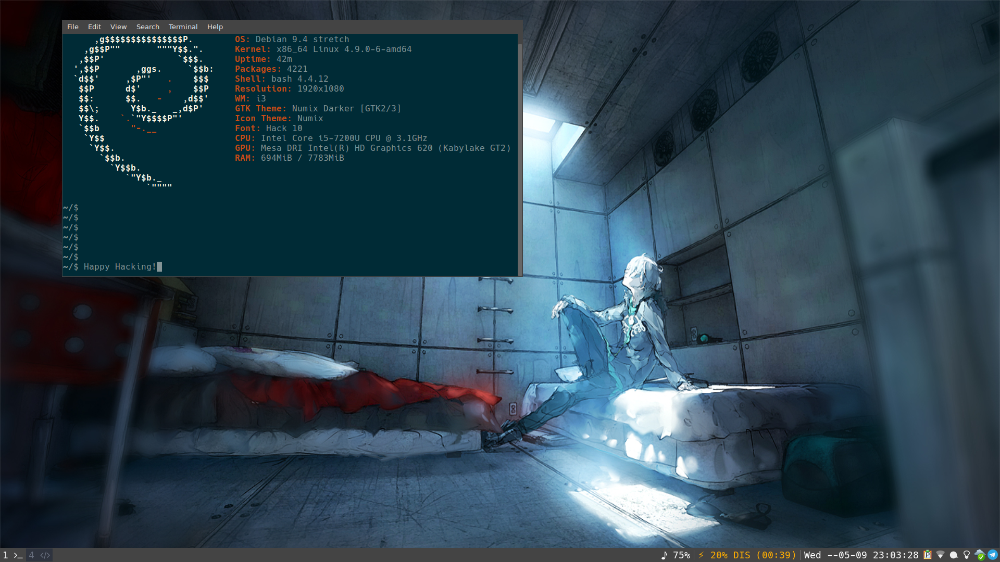

# My Debian Setup

Related blog post: [https://blog.diogo.site/posts/i3wm](https://blog.diogo.site/posts/i3wm)

## Installing

### Download

Download the XFCE CD1 from: https://cdimage.debian.org/debian-cd/current/amd64/iso-cd

### Repositories Keys

    wget -q https://www.virtualbox.org/download/oracle_vbox_2016.asc -O- | sudo apt-key add -
    wget -q https://www.virtualbox.org/download/oracle_vbox.asc -O- | sudo apt-key add -

### USB flash installation media

    dd if=debian-9.2.1-amd64-xfce-CD-1.iso of=/dev/sdb bs=4M

### Software selection

Select:

* print server
* standard system utilities

## Setting the repositories

    apt install aptitude
    aptitude install debian-archive-keyring
    aptitude install synaptic apt-xapian-index gdebi

## SUDO

### Install sudo
    aptitude install sudo gksu

### Add Administrator to sudoers
    adduser {username} sudo

## Hardware

### Firmware
    aptitude install firmware-linux intel-microcode amd64-microcode initramfs-tools firmware-amd-graphics
    aptitude install inotify-tools inotify-hookable sassc
    dpkg --add-architecture i386
    
### Wifi

    aptitude install firmware-realtek firmware-iwlwifi

### Battery and Overheating

* tlp
* tlp-rdw
* thermald
* cpufreqd

`sudo aptitude install tlp tlp-rdw thermald cpufreqd`

> For thinkpads only: `sudo aptitude install tp-smapi-dkms acpi-call-dkms`

### Hardware sensors

* lm-sensors
* hddtemp
* psensor
* i7z
* cpupower

`sudo aptitude install lm-sensors hddtemp psensor`

### Disable bluetooth auto power-on

Blueman automatically enables Bluetooth adapter when certain events (on boot, laptop lid is opened, ...) occur. This can be disabled with the auto-power-on in org.blueman.plugins.powermanager: 

    sudo gsettings set org.blueman.plugins.powermanager auto-power-on false

### Network

Proper network manager with VPN support

* network-manager
* network-manager-gnome
* network-manager-openvpn
* network-manager-vpnc
* network-manager-vpnc-gnome
* network-manager-pptp
* network-manager-pptp-gnome
* network-manager-openvpn
* network-manager-openvpn-gnome
* pptpd
* ppp
* pptp-linux

`sudo aptitude install network-manager network-manager-gnome network-manager-openvpn network-manager-vpnc network-manager-vpnc-gnome network-manager-pptp network-manager-pptp-gnome network-manager-openvpn network-manager-openvpn-gnome pptpd ppp pptp-linux`

## Shell

* `sudo aptitude install zsh`

## Appearance

### Utilities

* lxappearance
* xsettingsd
* nitrogen

### Theme

* numix-gtk-theme
* numix-icon-theme

`sudo aptitude install numix-gtk-theme numix-icon-theme`

### Fonts

* ttf-freefont
* ttf-mscorefonts-installer
* ttf-dejavu
* ttf-liberation
* fonts-hack-ttf
* fonts-font-awesome

`sudo aptitude install ttf-freefont ttf-mscorefonts-installer ttf-dejavu ttf-liberation fonts-hack-ttf fonts-font-awesome`

### Spotlight

[Diogo's spotlight script](https://git.gnu.io/snippets/107)

### i3

* i3
* suckless-tools
* i3status
* i3blocks
* [XBright](https://github.com/snobb/xbright)
* [morc_menu](https://github.com/Boruch-Baum/morc_menu)
* ranger
* cinnamon-settings-daemon
* cinnamon-screensaver

`sudo aptitude install i3 suckless-tools i3status i3blocks ranger nitrogen cinnamon-settings-daemon cinnamon-screensaver`

## System

### Notifications

* xfce4-notifyd

`sudo aptitude install xfce4-notifyd`

### SECURITY (FIREWALL AND ANTI-VIRUS)

    sudo aptitude install ufw gufw clamav clamtk
    sudo ufw default deny
    sudo ufw enable

### Updates notifier

* pk-update-icon
* apt-config-auto-update

`sudo aptitude install pk-update-icon apt-config-auto-update`

### Power Manager

* xfce4-power-manager

`sudo aptitude install xfce4-power-manager`

### Wine

`sudo aptitude -t stretch-backports install wine`

## General Software

### Multimedia

* pavucontrol
* libavcodec-extra
* icedtea-plugin
* rhythmbox
* gimp
* totem
* handbrake
* kdenlive
* audacity
* cmus

`sudo aptitude install pavucontrol libavcodec-extra icedtea-plugin rhythmbox gimp totem handbrake kdenlive audacity cmus`

### Utilities

* tmux
* parcellite
* qalculate
* gparted
* kazam
* kde-spectacle
* eom
* engrampa
* xrandr
* arandr
* redshift-gtk

`sudo aptitude install tmux parcellite qalculate gparted libreoffice kazam kde-spectacle eom engrampa xrandr arandr redshift-gtk`

### Programming

* geany with [Darcula colorscheme](https://raw.githubusercontent.com/codebrainz/geany-themes/master/colorschemes/darcula.conf)
* netbeans
* git

`sudo aptitude install geany netbeans git`

#### VIM

* `sudo aptitude purge vim-tiny`
* `sudo aptitude install vim`
* [vimrc](https://github.com/amix/vimrc)

### Internet

* firefox
* deluge
* thunderbird

`sudo aptitude install firefox deluge thunderbird`

#### Chatting

* [hexchat](https://hexchat.readthedocs.io/en/latest/building.html#unix) (with [Monokai](https://hexchat.github.io/themes.html) theme)
* `sudo aptitude install gajim` with [gajim-dark](https://github.com/ntrrgc/gajim-dark)

#### KDE CONNECT

    sudo aptitude install kdeconnect
    sudo ufw allow 1714:1764/udp
    sudo ufw allow 1714:1764/tcp
    sudo ufw reload

### Math

* bc
* SageMath
* GNUPlot

`sudo aptitude install bc sagemath gnuplot`

### Office

* atril
* libreoffice

`sudo aptitude install atril libreoffice`
